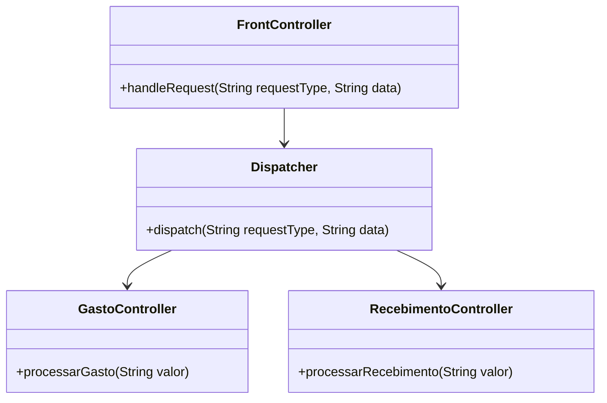

# Padrão Front Controller: Centralizando o Controle de Requisições

## Motivacão
O padrão de projeto **Front Controller** é utilizado para centralizar o processamento de requisições em aplicações web. Ele atua como um ponto de entrada único para todas as requisições, permitindo a implementação de funcionalidades comuns, como autenticação, logging e direcionamento para controladores específicos.

Neste exemplo, utilizamos o **Front Controller** para gerenciar um sistema financeiro, onde há opções de **gastos** e **recebimentos**. Todas as requisições passam pelo **Front Controller**, que as encaminha para os controladores adequados.

## UML do Front Controller

## Código do Front Controller

### **Implementação do Front Controller**

@import "src/frontcontroller/controller/FrontController.java"

### **Dispatcher: Encaminha requisições para os controladores adequados**

@import "src/frontcontroller/controller/Dispatcher.java"

### **Controllers: Processam gastos e recebimentos**

#### GastoController

@import "src/frontcontroller/controller/GastoController.java"

#### RecebimentoController

@import "src/frontcontroller/controller/RecebimentoController.java"

### **Implementação do Cliente (Main)**

@import "src/frontcontroller/main/Main.java"

## **Explicação do Código**
- **Criamos o `FrontController`**, que recebe todas as requisições e executa autenticação e logging antes de encaminhá-las.
- **Criamos o `Dispatcher`**, que é responsável por enviar a requisição para os controladores adequados.
- **Criamos os controladores `GastoController` e `RecebimentoController`**, que tratam os diferentes tipos de requisições.
- **No `Main`**, simulamos requisições de gastos e recebimentos, que passam pelo `FrontController`.

## **Participantes**

- **Front Controller (`FrontController`)**
  - Atua como ponto central para o processamento de requisições.
  - Adiciona funcionalidades comuns como autenticação e logging.
  
- **Dispatcher (`Dispatcher`)**
  - Responsável por encaminhar requisições para os controladores corretos.

- **Controllers (`GastoController`, `RecebimentoController`)**
  - Tratam as requisições específicas, processando os dados conforme a necessidade.

- **Cliente (`Main`)**
  - Envia requisições ao `FrontController`, que gerencia e distribui as ações no sistema.

